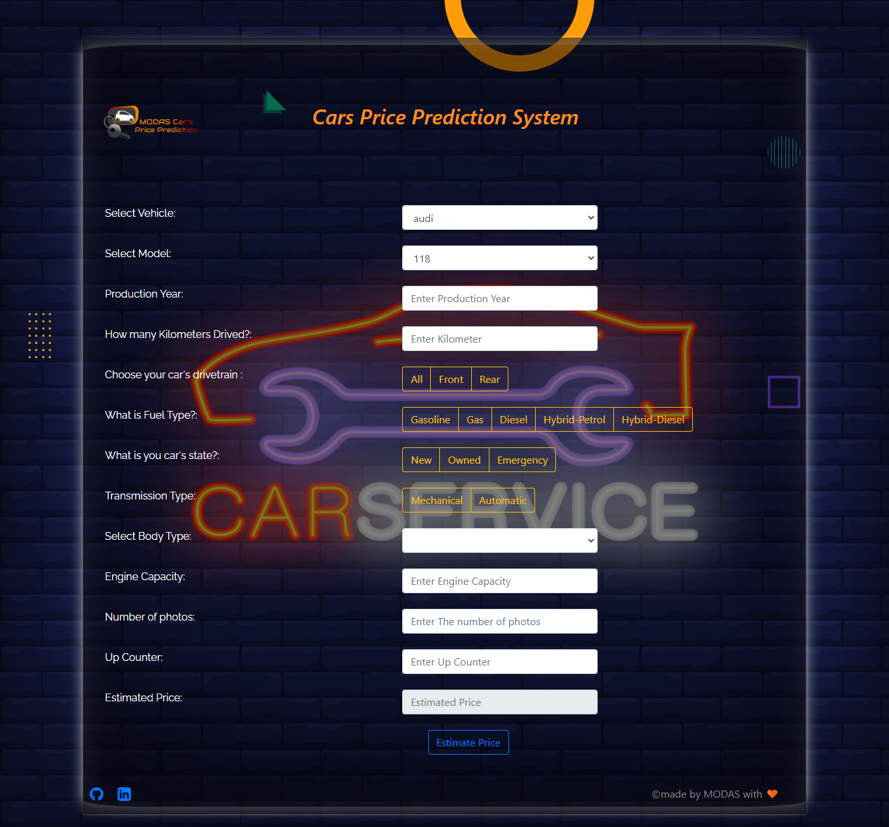

  <a href="https://github.com/Said-bachar/MODAS-CarsPricePrediction">
     <h3 align="center">Modas Cars Price Prediction System</h3>
  </a>

  

    Cars Price Prediction System a ML that predict the price of a lot of cateogories of cars.
     
    <a href="#about-the-project">View Demo</a>
  

---

## Table of Contents

* [About the Project](#about-the-project)
  * [Project in one image ](#project-in-one-image)
* [Tools and Technologies ](#tools-and-technologies)

## About The Project

    

This project is about Cars Selling Price Prediction, In this project we will take some input from user and my machine learning model will predict selling price of vehicle.

## Project in one image 

    

## Tools and Technologies

  

• In this project we used a dataset from kaggle.com, we had trained a **Machine Learning** model and i got **95.92%** accuracy using Random Forest Regressor.

• This repository consists of files required to deploy a ___Machine Learning Web App___ created with ___Flask___ 

• If you are searching for __Code__, __Algorithms used__ and __Accuracy__ of the model.. you can find it in **vehicle selling price prediction.ipynb** file

***

• If you like our work and it helped you in anyway then please do ⭐ the repository it will motivate me to make more amazing projects. 